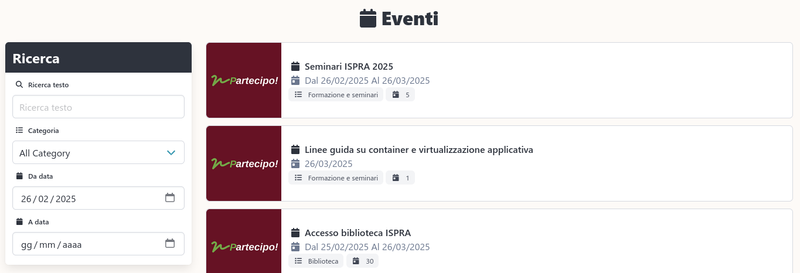
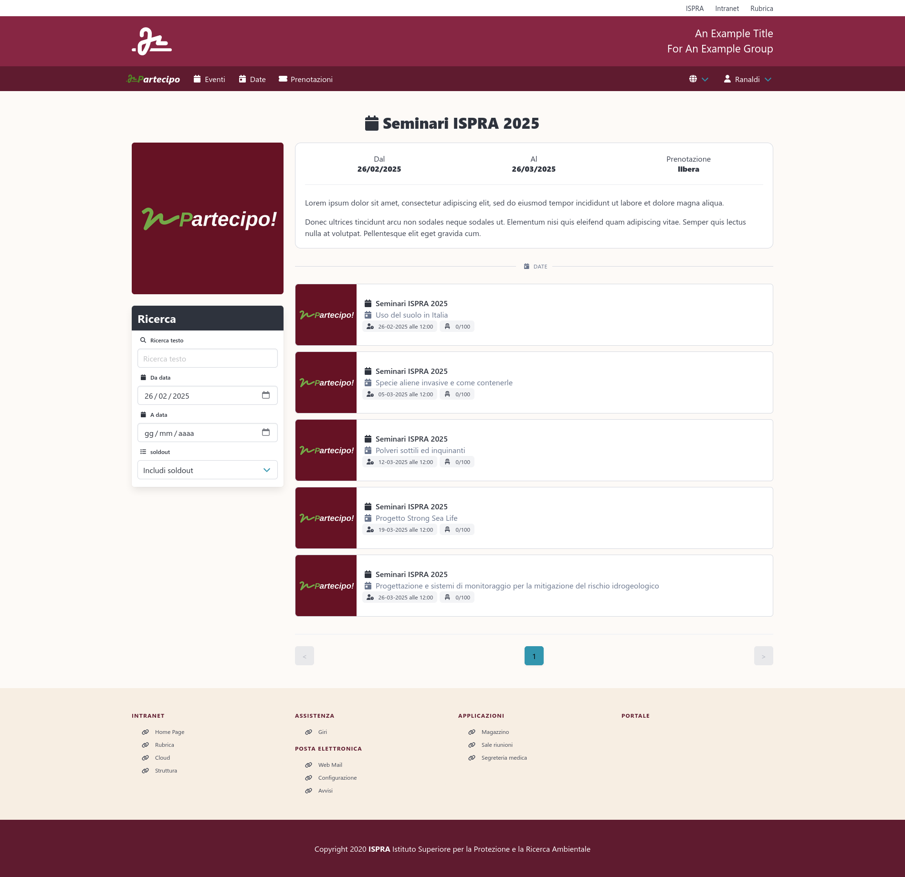
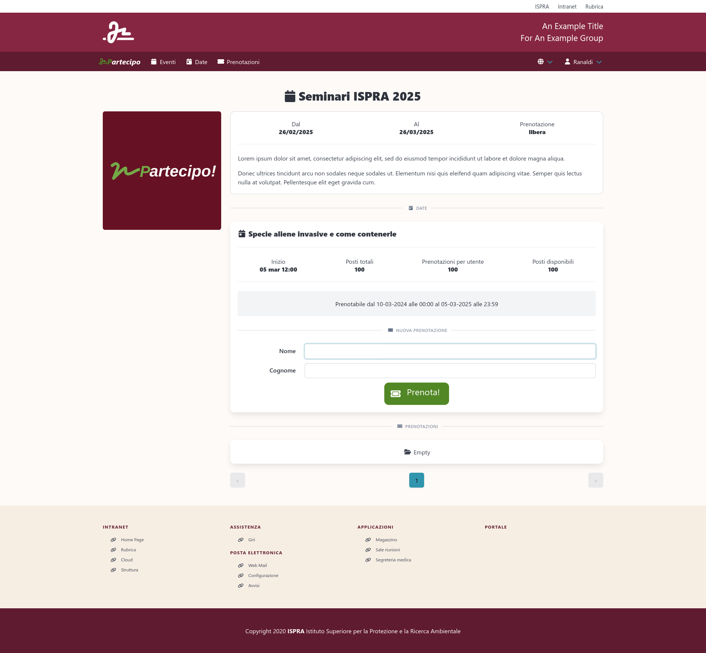
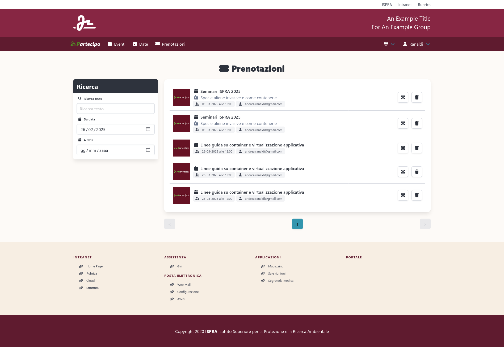

[](https://coveralls.io/github/isprambiente/Partecipo?branch=master)
[](http://inch-ci.org/github/isprambiente/Partecipo)
[](http://rubydoc.info/github/isprambiente/partecipo/master)
[](https://codeclimate.com/github/isprambiente/Partecipo/maintainability)

# Partecipo!

Il programma nasce dalla necessità [I.S.P.R.A.](http://www.isprambiente.gov.it) di gestire la prenotazione di alcuni eventi ISPRA ed è cresciuto grazie allo stimolo e la collaborazione di altri enti come il CNR.

Il programma permette la gestione di eventi con date multiple. Per ogni data è possibile personalizzare il numero di posti disponibili e prenotabili da un utente, inoltre è possibile definire la frequesza con la quale è possibile iscriversi ad un evento. Per ogni prenotazione è possibile richiedere la compilazione di un form con informazioni specifiche. Infine è possibile rendere accessibile un evento esclusivamente ai membri del proprio ente. Il programma permette di essere configurato tramite dei semplici environments, inclusa l'autenticazione OIDC per l'autenticazione centralizzata dei vari enti.

### Elenco eventi

### Dettagli evento con date

### Prenotazione di una data

### Gesione prenotazioni


## Licenza
Il codice sorgente del sito progetto è rilasciato sotto licenza MIT License (codice SPDX: MIT). La licenza è visibile nel file [LICENSE](https://opensource.org/licenses/MIT)

### Specifiche tecniche progetto
* [Ruby](https://www.ruby-lang.org)
* [RAILS](https://rubyonrails.org/)
* [Bun](https://bun.sh/)
* [Postgresql](https://www.postgresql.org/)
* HTML5 + CSS3
* no jQuery

### Requisiti tecnici per ambiente server
* Linguaggio di programmazione: Ruby 3.4
* Framework: Rais 8.1
* Bun
* Database: PostgreSQL >= 12.2

o in alternativa
* Docker

### Requisiti minimi per i client
* Mozilla Firefox 53, Chrome 58, Microsoft Edge, Internet Explorer 11, Safari 9.0 o altro browser compatibile con HTML 5, CSS 3;
* Per Internet Explorer 11 la modalità di compatibilità deve essere disattivata;
* Javascript abilitato;
* Cookie abilitati;
* Supporto ai certificati SSL;

### Configurazione consigliata per i client
* Mozilla Firefox >= 53, Chrome >= 58, Microsoft Edge, Safari 9.0 o altro browser compatibile con HTML 5 e CSS 3;
* Javascript abilitato;
* Cookie abilitati;
* Supporto ai certificati SSL;

## Installazione ambiente
Installare ruby 3.3.0, consigliato [RVM](https://rvm.io/).

## Installazione applicazione

### In sviluppo

1. Clonare il progetto in sviluppo 

    ```
      git clone https://github.com/isprambiente/partecipo.git
    ```

2. Da una shell posizionarsi sulla root del progetto ed eseguire

    ```
      gem install bundle
      bundle install
      bun install
    ```

3. La maggior parte delle impostazioni sono configurabili tramite gli environments di sistema che possono essere visualizzati nel file docker-compose.yml.

### Demo con docker / docker compose
1. Clonare il progetto in sviluppo `git clone https://github.com/isprambiente/Partecipo/`
2. Personalizzare il file docker-compose aggiornando gli env di configurazione. La configurazione di esempio è pensata per essere eseguita localmente in http
3. Entrare nella directory `cd Partecipo`
4. Complare l'immaggine e acviare il compose con il comando `docker compose up --build`, al termine dell'operazione il sistema sarà attivo su http://localhost
5. Per accedere utilizzare le seguenti credenziali:
  * admin@partecipo.it  - partecipo # per utente amministratore
  * editor@partecipo.it - partecipo # per utente editor
  * user@partecipo.it   - partecipo # per utente standard

### Partecipa!
Puoi collaborare allo sviluppo dell'applicazione e della documentazione tramite [github](https://github.com/isprambiente/Partecipo).

Tramite [Github discussions](https://github.com/isprambiente/Partecipo/discussions) è possibile richiedere e offrire aiuto.

Se riscontrate errori e bug potete segnalarli nella paggina delle [Issues](https://github.com/isprambiente/Partecipo/issues)
